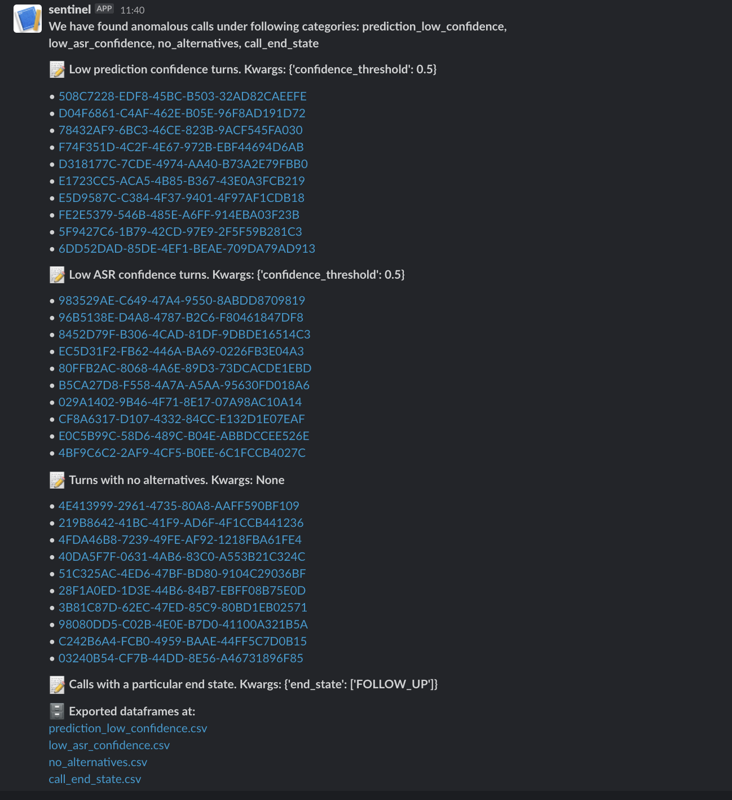

---
# Feel free to add content and custom Front Matter to this file.
# To modify the layout, see https://jekyllrb.com/docs/themes/#overriding-theme-defaults

layout: default
title: Home
nav_order: 1
---

<h1 align="center">Sentinel</h1>

<p align="center"></p>


[](https://github.com/skit-ai/sentinel/actions/workflows/test.yml)
[](https://github.com/skit-ai/sentinel/actions/workflows/docs.yml)

[Sentinel][sentinel] is an anomalous call monitoring and filtering system which picks calls
that are weird in some way or the other and push them to a daily report.

It works on calls/turn data as defined in [dataframes](https://github.com/skit-ai/dataframes) that has standard datatype
definitions.

## Installation

```
pip install https://github.com/skit-ai/sentinel/releases/download/0.2.6/sentinel-0.2.6-py3-none-any.whl
```

## Usage

### Running sentinel

To run sentinel against a dataframe, you need to first create a config file
which has definition of the dataframe to use, filters to apply, reporting etc.
More about config in the doc [here](./config-spec.html)

```bash
sentinel run --config-yml=config.yml
```

Based on the config for exporting report, you'll get calls/turns in Slack or email.

To get the available filter functions do:

### Filter list

```bash
sentinel list
```

This will give a list of available filter names and their description like below:

```
Available filter functions:

+---------------------------+------------------------------------------------+
| filters                   | description                                    |
+===========================+================================================+
| no_alternatives           | Turns with no alternatives                     |
+---------------------------+------------------------------------------------+
| filter_words              | Turns with certain words                       |
+---------------------------+------------------------------------------------+
| low_asr_confidence        | Low ASR confidence turns                       |
+---------------------------+------------------------------------------------+
| prediction_low_confidence | Low prediction confidence turns                |
+---------------------------+------------------------------------------------+
| call_end_state            | Calls with a particular end state              |
+---------------------------+------------------------------------------------+
| state_stuck               | Calls which are stuck in particular state      |
+---------------------------+------------------------------------------------+
| state_loop                | Calls which come back to already visited state |
+---------------------------+------------------------------------------------+
```

### Filter list with verbose description

```bash
sentinel list --verbose
```

This will give a list of available filter names and their verbose description like below:

```
+---------------------------+--------------------------------------------------------------------------------------------------+
| filters                   | description                                                                                      |
+===========================+==================================================================================================+
| no_alternatives           | This filter reports turns with no alternatives.                                                  |
|                           |                                                                                                  |
|                           |     In most of the cases, these are turns where users are unresponsive.                          |
+---------------------------+--------------------------------------------------------------------------------------------------+
| filter_words              | This filter can be used to flag out turns with certain words.                                    |
|                           |                                                                                                  |
|                           |     Use the below keyword arguments in the config to specify configurable attributes.            |
|                           |     kwargs:                                                                                      |
|                           |         word_list (list): List of words to be flagged out.                                       |
+---------------------------+--------------------------------------------------------------------------------------------------+
| low_asr_confidence        | This filter flags turns where best alternative from ASR has confidence lest than some threshold. |
|                           |                                                                                                  |
|                           |     Use the below keyword arguments in the config to specify configurable                        |
|                           |     attributes.                                                                                  |
|                           |     kwargs:                                                                                      |
|                           |         confidence_threshold (int): Confidence threshold.                                        |
+---------------------------+--------------------------------------------------------------------------------------------------+
| prediction_low_confidence | This filter flags turns with SLU prediction confidence less than some threshold.                 |
|                           |                                                                                                  |
|                           |     Use the below keyword arguments in the config to specify configurable                        |
|                           |     attributes.                                                                                  |
|                           |     kwargs:                                                                                      |
|                           |         confidence_threshold (float): Confidence threshold.                                      |
+---------------------------+--------------------------------------------------------------------------------------------------+
| call_end_state            | This filter flags out calls with a particular end state.                                         |
|                           |                                                                                                  |
|                           |                                                                                                  |
|                           |     Use the below keyword arguments in the config to specify configurable                        |
|                           |     attributes.                                                                                  |
|                           |     kwargs:                                                                                      |
|                           |         end_state: list of strings of the end state(s) to filter out.                            |
+---------------------------+--------------------------------------------------------------------------------------------------+
| state_stuck               | This filter flags out calls which are stuck in a particular state.                               |
|                           |                                                                                                  |
|                           |     Parameters:                                                                                  |
|                           |         max_state_count: int, the maximum number of times a state can be repeated.               |
|                           |                                                                                                  |
|                           |     Current dataframe consist of user and bot turn hence for a call to be stuck                  |
|                           |     at a state `SAMPLE_STATE` for 5 consecutive turns, the `max_state_count`                     |
|                           |     value must be 5.                                                                             |
+---------------------------+--------------------------------------------------------------------------------------------------+
| state_loop                | This filter flags out calls where the call comes back to an already visited state.               |
|                           |                                                                                                  |
|                           |     A user might be on a state for multiple turns but once they move to a                        |
|                           |     different turn and again come back to the visited turn, this filter flags                    |
|                           |     them.                                                                                        |
+---------------------------+--------------------------------------------------------------------------------------------------+
```

## Reporting

Currently, sentinel supports exporting results on Slack.

### Slack

Below is a screenshot of exports on Slack.


### Email

...

[sentinel]: https://github.com/skit-ai/sentinel
